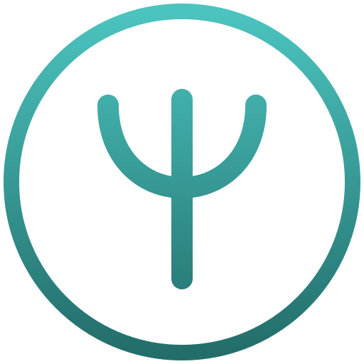
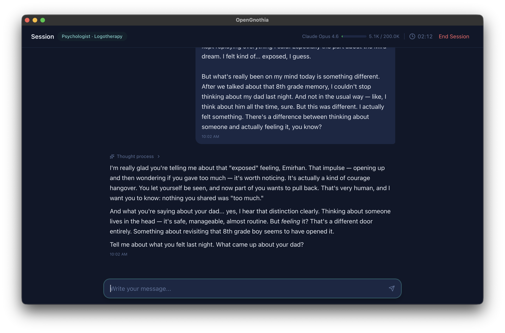
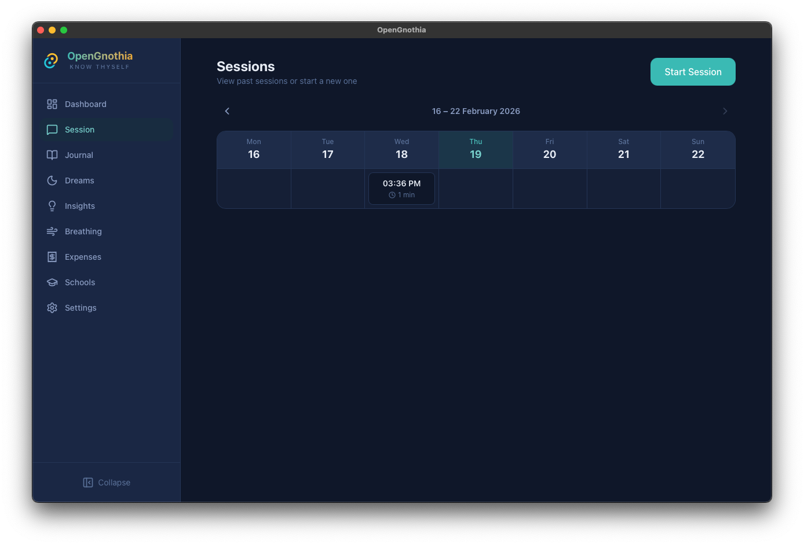
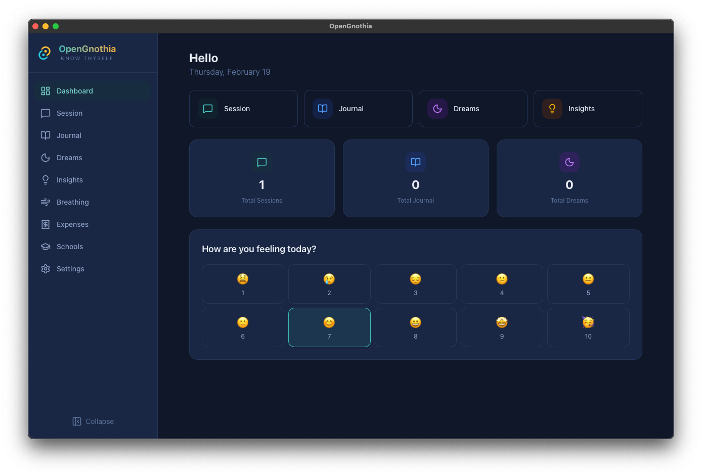
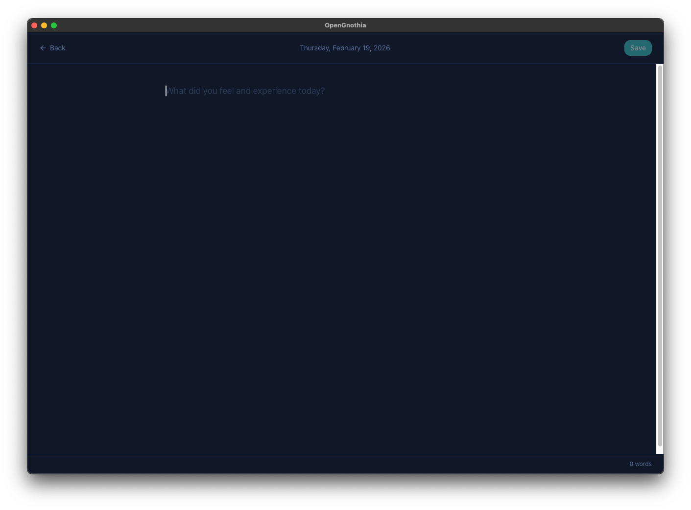
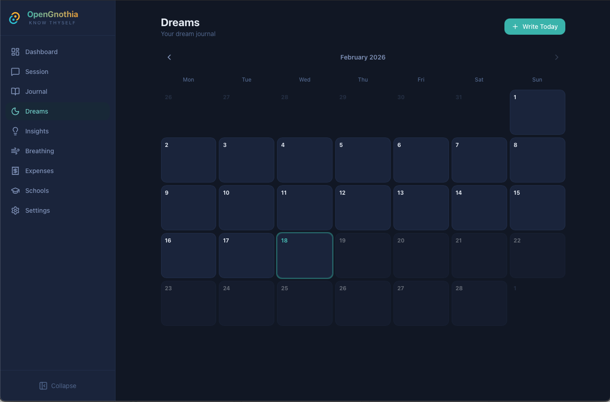
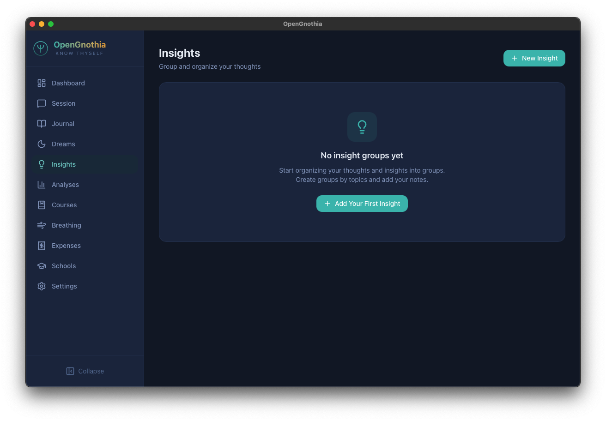
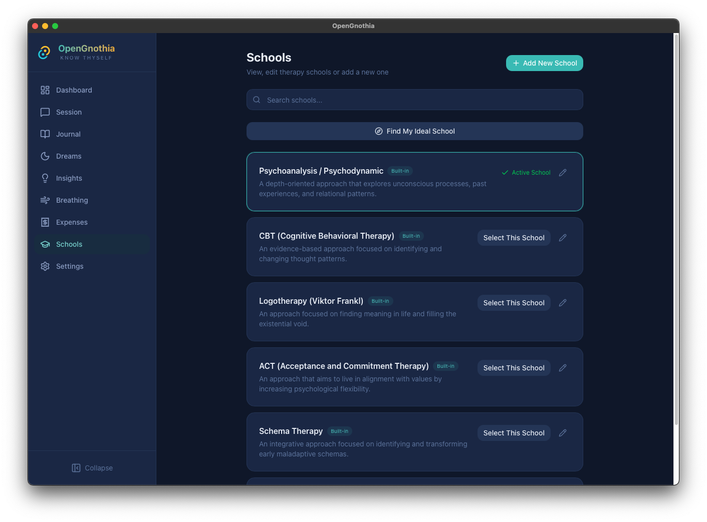
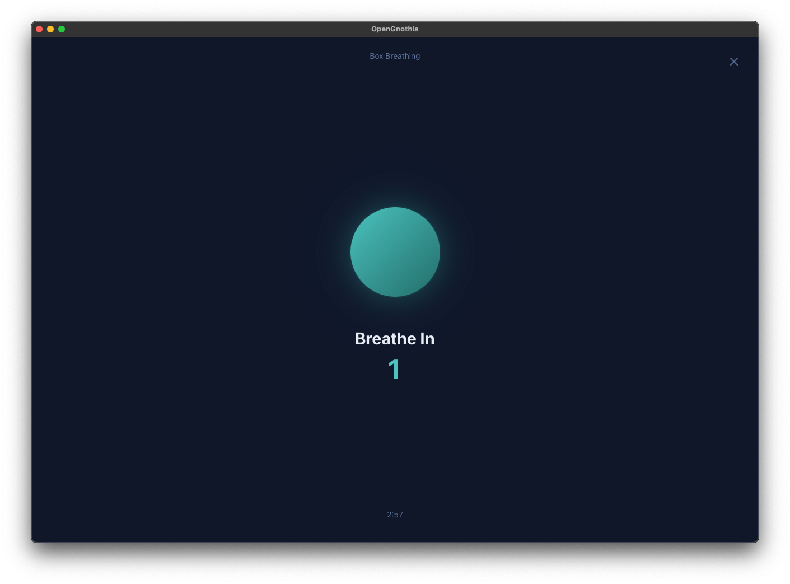
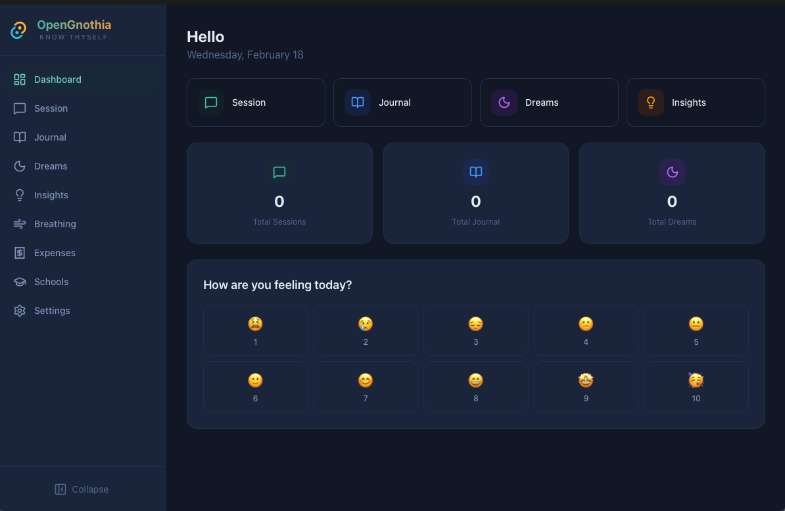

<div align="center">
  
  <h1>OpenGnothia</h1>
  <p><strong><em>"Gnôthi Seautón" — Know Thyself</em></strong></p>
  <p>An AI-powered, privacy-first self-therapy desktop application that helps you explore your inner world through therapy sessions, journaling, dream analysis, and more.</p>

  <br />

  [](LICENSE)
  [](https://github.com/Lepuz-coder/opengnothia/releases)
  [](#getting-started)
  [](https://v2.tauri.app)
  [](https://react.dev)
  [](https://www.rust-lang.org)

  <br />

  [Website](https://opengnothia.com) · [Download](https://github.com/Lepuz-coder/opengnothia/releases) · [Report Bug](https://github.com/Lepuz-coder/opengnothia/issues) · [Request Feature](https://github.com/Lepuz-coder/opengnothia/issues)

</div>

<br />

---

## Why OpenGnothia?

Mental health support should be accessible, private, and personalized. OpenGnothia combines the power of modern AI with evidence-based therapeutic approaches to create a self-therapy companion that lives entirely on your device.

- **Your data never leaves your device** — all sessions, journal entries, and insights are stored locally in SQLite
- **Choose your therapeutic approach** — from Psychoanalysis to CBT, Stoicism to Schema Therapy
- **Bring your own AI** — works with Anthropic Claude, OpenAI, or any compatible API endpoint
- **Open source and transparent** — review every line of code that handles your most personal thoughts

> **Note:** OpenGnothia is a self-exploration tool, not a replacement for professional mental health care. If you are in crisis, please reach out to a licensed professional or crisis helpline.

---

## Screenshots

<div align="center">
  <table>
    <tr>
      <td colspan="2" align="center"><br /><sub><b>Live Therapy Session</b></sub></td>
    </tr>
    <tr>
      <td align="center"><br /><sub><b>AI Therapy Session</b></sub></td>
      <td align="center"><br /><sub><b>Mood Tracking</b></sub></td>
    </tr>
    <tr>
      <td align="center"><br /><sub><b>Journal</b></sub></td>
      <td align="center"><br /><sub><b>Dream Analysis</b></sub></td>
    </tr>
    <tr>
      <td align="center"><br /><sub><b>AI-Generated Insights</b></sub></td>
      <td align="center"><br /><sub><b>Therapy Schools</b></sub></td>
    </tr>
    <tr>
      <td align="center"><br /><sub><b>Breathing Exercises</b></sub></td>
      <td align="center"><br /><sub><b>Dashboard</b></sub></td>
    </tr>
  </table>
</div>

---

## Demo

<div align="center">

[**Interactive Demo — Complete onboarding and start your first session**](https://demo.arcade.software/ESv470JvwuB0mFtliDUX?embed&embed_mobile=tab&embed_desktop=inline&show_copy_link=true)

</div>

---

## Features

### AI Therapy Sessions
Engage in meaningful conversations with an AI therapist that adapts to your chosen therapeutic approach. Each session includes real-time streaming responses, session timers, and automatic summaries with identified themes, defense mechanisms, insights, and homework suggestions.

### Journal
Write and reflect on your daily thoughts. Each entry supports mood tagging and optional AI analysis to help you identify patterns and gain deeper understanding of your experiences.

### Dream Analysis
Record your dreams and explore their meaning with AI-assisted interpretation. Build a searchable dream diary to track recurring symbols and themes over time.

### Mood Tracking & Check-ins
Track your daily mood, energy levels, and sleep quality. View your emotional patterns on a calendar with visual mood indicators to understand your mental health trends.

### AI-Generated Insights
Receive AI-generated insights drawn from your sessions and journal entries. Organize them into groups, pin important ones, and revisit them as your self-understanding deepens.

### Breathing Exercises
Access guided breathing techniques to manage stress and anxiety. Multiple breathing patterns are available to suit different needs and moments.

### Therapy Programs
Follow structured therapy programs that guide your self-discovery journey with progressive exercises and reflections.

### Multi-Provider AI Support
Bring your own API key and choose from a wide range of models:
- **Anthropic Claude** — Opus, Sonnet, and Haiku families (with extended thinking support)
- **OpenAI** — GPT-5 series, GPT-4.1, GPT-4o families
- **Custom endpoints** — Connect any OpenAI-compatible API

### Privacy & Security
- All data stored locally in SQLite — no cloud sync, no telemetry
- Biometric lock with Touch ID support (macOS)
- Password protection
- API keys stored only on your device, sent only to the provider you choose

### Multi-Language
Available in English and Turkish, with an extensible internationalization system.

---

## Therapy Schools

OpenGnothia includes carefully crafted therapeutic prompts for six different approaches. Each school shapes how the AI listens, responds, and guides your sessions:

| School | Founded By | Focus |
|--------|-----------|-------|
| **Psychoanalysis / Psychodynamic** | Sigmund Freud | Unconscious processes, past experiences, relational patterns |
| **CBT (Cognitive Behavioral Therapy)** | Aaron Beck | Identifying and changing thought patterns and behaviors |
| **Logotherapy** | Viktor Frankl | Finding meaning in life, even in unavoidable suffering |
| **ACT (Acceptance and Commitment Therapy)** | Steven C. Hayes | Psychological flexibility, values-aligned living |
| **Schema Therapy** | Jeffrey Young | Identifying and transforming early maladaptive schemas |
| **Stoicism (Philosophical Counseling)** | Marcus Aurelius, Epictetus, Seneca | Inner peace, virtue, and rational response to life |

---

## Tech Stack

| Layer | Technology |
|-------|-----------|
| **Frontend** | React 19, TypeScript, TailwindCSS 4 |
| **Build Tool** | Vite 7 |
| **Desktop Runtime** | Tauri 2 |
| **Backend** | Rust |
| **Database** | SQLite (via tauri-plugin-sql) |
| **State Management** | Zustand |
| **Routing** | React Router 7 |
| **Icons** | Lucide React |
| **Markdown** | React Markdown |

---

## Architecture

```
opengnothia/
├── src/                        # React frontend
│   ├── components/             # UI components
│   │   ├── ui/                 # Reusable primitives (Button, Card, Modal, etc.)
│   │   ├── chat/               # Chat interface (messages, input, timer)
│   │   ├── breathing/          # Breathing exercise components
│   │   ├── session/            # Session-related components
│   │   └── onboarding/         # First-run onboarding flow
│   ├── pages/                  # Route pages (Dashboard, Session, Journal, etc.)
│   ├── stores/                 # Zustand state stores
│   ├── services/
│   │   ├── ai/                 # AI provider integration & prompt building
│   │   └── db/                 # SQLite database queries
│   ├── constants/              # Therapy schools, providers, breathing techniques
│   ├── hooks/                  # Custom React hooks
│   ├── i18n/                   # Internationalization (en, tr)
│   ├── types/                  # TypeScript type definitions
│   └── lib/                    # Utility functions
│
├── src-tauri/                  # Tauri / Rust backend
│   ├── src/                    # Rust source (main.rs, lib.rs)
│   ├── migrations/             # SQLite migration files (12 versions)
│   ├── icons/                  # App icons for all platforms
│   ├── Cargo.toml              # Rust dependencies
│   └── tauri.conf.json         # Tauri configuration
│
├── assets/                     # Static assets
│   └── screenshots/            # App screenshots
├── package.json
├── vite.config.ts
└── tsconfig.json
```

**Data Flow:**
```
User ──> React UI ──> Zustand Store ──> Tauri Commands ──> SQLite (local)
                          │
                          └──> AI Service ──> Anthropic / OpenAI / Custom API
```

All data stays on the user's device. The only external communication is with the AI provider of your choice, using your own API key.

---

## Getting Started

### Prerequisites

- [Node.js](https://nodejs.org/) v18+
- [pnpm](https://pnpm.io/)
- [Rust](https://www.rust-lang.org/tools/install)
- [Tauri CLI prerequisites](https://v2.tauri.app/start/prerequisites/)

### Installation

```bash
# Clone the repository
git clone https://github.com/Lepuz-coder/opengnothia.git
cd opengnothia

# Install dependencies
pnpm install

# Run in development mode
pnpm tauri dev

# Build for production
pnpm tauri build
```

### macOS: "App is damaged" Warning

If you download OpenGnothia from GitHub Releases on macOS, you may see a **"OpenGnothia is damaged and can't be opened"** warning. This happens because the app is not signed with an Apple Developer certificate.

To fix this, open Terminal and run:

```bash
xattr -cr /Applications/OpenGnothia.app
```

If you downloaded it to a different location:

```bash
xattr -cr ~/Downloads/OpenGnothia.app
```

This removes the macOS quarantine attribute and allows the app to open normally.

### First Launch

On first launch, the onboarding flow will guide you through:

1. **AI Provider** — Select Anthropic, OpenAI, or a custom endpoint
2. **API Key** — Enter your API key (stored locally, never shared)
3. **Model Selection** — Choose your preferred AI model
4. **Therapy School** — Pick a therapeutic approach that resonates with you
5. **Profile** — Set your name and preferences

You're ready to start your self-therapy journey.

---

## Configuration

All configuration is managed through the in-app Settings page:

- **AI Provider & Model** — Switch providers or models at any time
- **Therapy School** — Change your therapeutic approach between sessions
- **Language** — Toggle between English and Turkish
- **Security** — Enable biometric lock or password protection
- **Extended Thinking** — Enable deeper AI reasoning for supported models (adaptive or budget mode)

---

## Contributing

Contributions are welcome! Whether it's a bug fix, new feature, translation, or documentation improvement, we appreciate your help.

### Development Workflow

1. Fork the repository
2. Create your feature branch (`git checkout -b feature/amazing-feature`)
3. Make your changes
4. Test in development mode (`pnpm tauri dev`)
5. Commit your changes (`git commit -m 'Add amazing feature'`)
6. Push to the branch (`git push origin feature/amazing-feature`)
7. Open a Pull Request

### Areas Where You Can Help

- **New therapy schools** — Add new therapeutic approaches with detailed system prompts
- **Translations** — Add new languages by creating translation files in `src/i18n/`
- **Breathing techniques** — Add new guided breathing patterns
- **UI/UX improvements** — Enhance the interface and user experience
- **Bug fixes** — Check [open issues](https://github.com/Lepuz-coder/opengnothia/issues) for known bugs
- **Documentation** — Improve guides, add examples, and clarify setup steps

---

## Roadmap

- [ ] More therapy school approaches (Gestalt, EMDR, DBT)
- [ ] Session export (PDF, Markdown)
- [ ] Advanced analytics and visualizations
- [ ] Plugin system for community extensions
- [ ] More languages
- [ ] Voice input support
- [ ] Optional encrypted cloud backup

---

## License

This project is licensed under the **MIT License** — see the [LICENSE](LICENSE) file for details.

---

## Acknowledgments

OpenGnothia stands on the shoulders of giants:

- **Sigmund Freud**, **Aaron Beck**, **Viktor Frankl**, **Steven C. Hayes**, **Jeffrey Young**, **Marcus Aurelius**, **Epictetus**, **Seneca** — for the therapeutic frameworks that guide the AI sessions
- [Tauri](https://tauri.app/) — for making native desktop apps with web technologies possible
- [React](https://react.dev/) — for the UI framework
- [Rust](https://www.rust-lang.org/) — for the secure, performant backend
- The open-source community — for making projects like this possible

---

<div align="center">
  <sub>Built with care for those who seek to know themselves.</sub>
  <br />
  <sub>If OpenGnothia helps you, consider giving it a star on GitHub.</sub>
</div>
